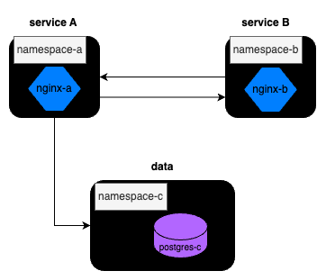

# Calico Network Policy

[](https://github.com/BrianHHough/intro-to-kube/actions/workflows/calico.yml)

## Note

You can also follow along with the info through the Uplimit Course [here](https://uplimit.com/course/kubernetes-managing-containers-at-scale/v2/module/project-3-instructions#corise_clm9w2tpt000k3b7ld7w684cy).

## Background

In a multi-tenanted, distributed system architecture, where multiple services are deployed across different namespaces, it becomes crucial to establish network policies to regulate and secure service-to-service communication. This is the next move for StartUpCo.

We will use Calico as a network policy agent. Calico is a flexible and scalable networking and security solution that operates at the Kubernetes network layer. It provides a powerful framework for network policy enforcement by leveraging the inherent capabilities of the underlying network fabric. With Calico, organizations can create fine-grained policies to control traffic flow between namespaces, pods, and other resources, ensuring only authorized service-to-service communication.



We will construct the following networking scheme:

### Namespace A - Networking Policies
- **Ingress Policy for Namespace A:** A network policy should be defined in namespace A to specify the ingress rules. This policy ensures that only incoming traffic from services residing in namespace B is permitted. You can think of pods in namespace B returning responses from API requests to Service B. 
- **Egress Policy for Namespace A:** Namespace A can send requests to all other namespaces (B and C). You can think of pods in Namespace A as a website needing to send requests to Service B to get certain info and then writing those results to the data layer in namespace C.

### Namespace B - Networking Policies
- **Ingress Policy for Namespace B:** This policy ensures that services in namespace B only accept requests from services residing in namespace A, creating a request/response secure communication channel. 
- **Egress Policy for Namespace B:** To further create that bidirectional communication, an egress policy should be enforced in namespace B such that it restricts outgoing traffic from services in namespace A.

### Namespace C - Networking Policies
- **Ingress Policy for Namespace C:** A network policy should be defined in namespace C such that it only receives requests from namespace A. These can be considered write request to the data layer from Service A without the need of a returned response from said request.

## Setup

Run minikube with the following command:

```bash
cd calico
minikube start --network-plugin=cni --cni=calico
```

Running this printed out:
```bash
😄  minikube v1.31.2 on Ubuntu 20.04 (docker/amd64)
✨  Using the docker driver based on existing profile
👍  Starting control plane node minikube in cluster minikube
🚜  Pulling base image ...
🔄  Restarting existing docker container for "minikube" ...
🐳  Preparing Kubernetes v1.27.4 on Docker 24.0.4 ...
🔗  Configuring Calico (Container Networking Interface) ...
🔎  Verifying Kubernetes components...
    ▪ Using image gcr.io/k8s-minikube/storage-provisioner:v5
🌟  Enabled addons: storage-provisioner, default-storageclass
🏄  Done! kubectl is now configured to use "minikube" cluster and "default" namespace by default
```

Also to start off the namespaces and pods, please run:

```bash
bash setup.sh
```

Running this printed out:
```bash
namespace/namespace-a created
namespace/namespace-b created
namespace/namespace-c created
Context "minikube" modified.
pod/nginx created
Context "minikube" modified.
pod/nginx created
Context "minikube" mod
```

## Testing

We have configured [GitHub Actions](https://github.com/features/actions) with minikube! GitHub Actions works as a CI/CD tool but for our intents and purposes, we will use it to create an autograder for your `yml` file changes. To test, create a branch in our `intro-to-kube` repo prefixed with
`calico-*` and push changes up to that branch. [See the output of your results here for reference](https://github.com/abanuelo/intro-to-kube/actions/workflows/calico.yml).

```bash
# create your branch
git checkout -b calico-<github-username>
# add your local changes
git add .
# commit your changes
git commit -m "<describe changes made>"
# push your changes to your upstream branch
git push -u origin calico-<github-username>
```

## Main Project

For this assignment, we will be looking closely at the [Kubernetes Ingress and Egress policies from their documentation](https://kubernetes.io/docs/concepts/services-networking/network-policies/). As a starter, try to find ways you can either

- (a) identify the pods belonging to a particular namespace using names/labels OR
- (b) identify the entire namespace from their names/labels OR
- (c) (not recommended) using the pods explict IPs to redirect traffic. This is not recommended since pods are usually deployed as a Deployment and their IPs are subject to change if they are deleted, cordoned, etc.

0. Fill out networking policy for namespace A under `network-policy-namespace-a.yml` and test your changes by pushing up a branch prefixed with `calico-`. You can also aim to manually test your changes by running the following commands below:

At the start, I check the number of pods with: `kubectl get pods` and see this:
```bash
NAME                                READY   STATUS    RESTARTS         AGE
nginx                               1/1     Running   13 (4m13s ago)   19d
nginx-deployment-5f54d4d754-rzv4m   1/1     Running   12 (4m13s ago)   19d
nginx-deployment-5f54d4d754-wbntq   1/1     Running   12 (4m12s ago)   19d
nginx-deployment-5f54d4d754-xzwj6   1/1     Running   12 (4m12s ago)   19d
nginx-pod                           1/1     Running   12 (4m12s ago)   19d
postgres-595d76d4f8-b56c4           1/1     Running   10 (4m11s ago)   5d10h
```


    a. First you will need to install curl on the postgres pod as it does not come installed by default. **Note: You only need to do this once after creating the postgres pod**
    
```bash
# exec into the container
kubectl exec -it postgres -n namespace-c -- bash

# once in the container run the `apt-get commands below`
root@postgres/# apt-get -y update; apt-get -y install curl

# exit the container
root@postgres/# exit
```


    b. Next you can run gather the IPs for your pods by running:
    
```bash
kubectl get pods --all_namespaces -o wide
```

For the namespaces we care about for this, we see this abridged version:
```bash
NAMESPACE     NAME                                       READY   STATUS    RESTARTS         AGE     IP             NODE       NOMINATED NODE   READINESS GATES
namespace-a   nginx                                      1/1     Running   3 (5m33s ago)    127m    10.244.1.90    minikube   <none>           <none>
namespace-c   postgres                                   1/1     Running   3 (5m32s ago)    127m    10.244.1.81    minikube   <none>           <none>
namespace-b   nginx                                      1/1     Running   3 (5m33s ago)    127m    10.244.1.86    minikube   <none>           <none>
```


    The ports for the nginx pods are 80 and 5432 for the postgres pod, respectively.

    c. To ping let's say the nginx pod from namespace A to the nginx pod in namespace B you can run:
    
```bash
kubectl exec nginx -n namespace-a -- curl <nginx pod IP from namespace-b>:<nginx port (ie 80)>

# example
kubectl exec nginx -n namespace-a -- curl 10.244.120.72:80
```

What I ran was this: `kubectl exec nginx -n namespace-a -- curl 10.244.1.90:80`

That logged this:
```bash
  % Total    % Received % Xferd  Average Speed   Time    Time     Time  Current
                                 Dload  Upload   Total   Spent    Left  Speed
100   615  100   615    0     0   6384      0 --:--:-- --:--:-- --:--:--  6406
<!DOCTYPE html>
<html>
<head>
<title>Welcome to nginx!</title>
<style>
html { color-scheme: light dark; }
body { width: 35em; margin: 0 auto;
font-family: Tahoma, Verdana, Arial, sans-serif; }
</style>
</head>
<body>
<h1>Welcome to nginx!</h1>
<p>If you see this page, the nginx web server is successfully installed and
working. Further configuration is required.</p>

<p>For online documentation and support please refer to
<a href="http://nginx.org/">nginx.org</a>.<br/>
Commercial support is available at
<a href="http://nginx.com/">nginx.com</a>.</p>

<p><em>Thank you for using nginx.</em></p>
</body>
</html>
```


    Or to ping from the nginx pod from namespace A to say the postgres pod in namespace-c you can trigger:
    
```bash
kubectl exec nginx -n namespace-a -- curl <postgres pod IP from namespace-c>:<postgres port (ie 5432)>

# example
kubectl exec nginx -n namespace-a -- curl 10.244.120.70:5432
```

I ran: `kubectl exec nginx -n namespace-a -- curl 10.244.1.81:5432`
This logged:
```bash
  % Total    % Received % Xferd  Average Speed   Time    Time     Time  Current
                                 Dload  Upload   Total   Spent    Left  Speed
  0     0    0     0    0     0      0      0 --:--:-- --:--:-- --:--:--     0
curl: (52) Empty reply from server
command terminated with exit code 5
```

^ PostgreSQL runs on port `5432` by default, but doesn't serve HTTP content, so a `curl` command won't give an HTTP response like it did for the nginx pod like it did earlier. But we can use `curl` to check if a `TCP` connection to the service can be established.

We can, however, check logs about the `postgres` pod in the `namespace-c`:
```bash
kubectl logs postgres -n namespace-c
```


1. Fill out networking policy for namespace B under `network-policy-namespace-b.yml` and test your changes by pushing up a branch prefixed with `calico-`. See manual testing steps above under item 0. as needed.

2. Fill out networking policy for namespace C under `network-policy-namespace-c.yml` and test your changes by pushing up a branch prefixed with `calico-`. See manual testing steps above under item 0. as needed.


All checks pass: https://github.com/BrianHHough/intro-to-kube/actions/runs/6609006982/job/17948544388

[](https://github.com/BrianHHough/intro-to-kube/actions/workflows/calico.yml)