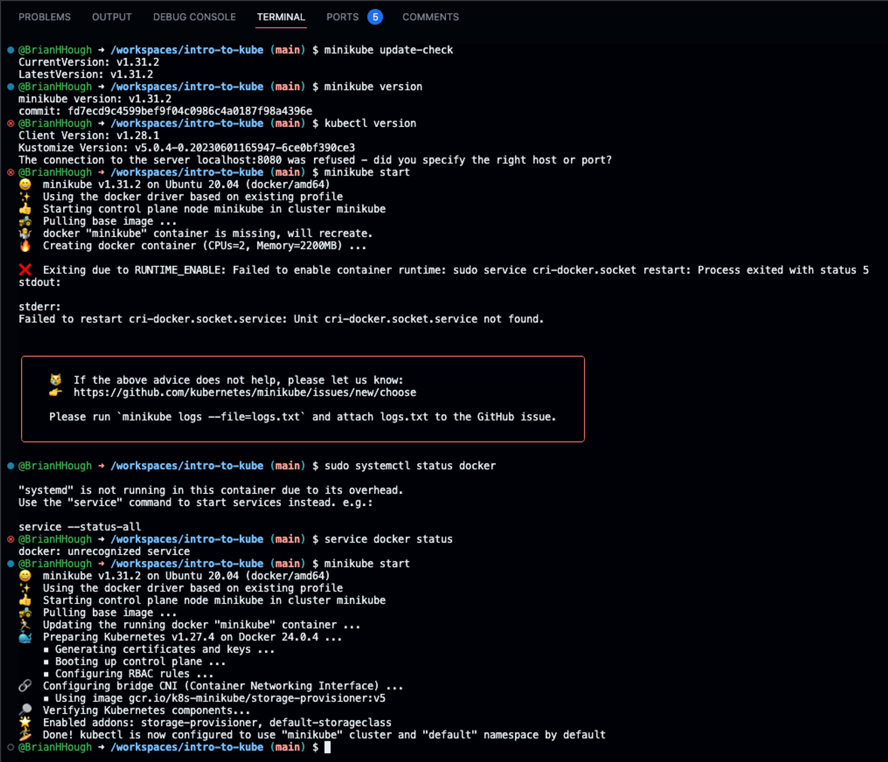

# Intro to Kubernetes
This is the update for Week 1 of setting up Kubernetes, Docker, and `kubectl` with `minikube`


# Starting up `minikube`
I tried to run this: `minikube start`

But, I got this output when I started, which means that it wasn't ready to run:

```bash
😄  minikube v1.31.2 on Ubuntu 20.04 (docker/amd64)
✨  Automatically selected the docker driver. Other choices: ssh, none
📌  Using Docker driver with root privileges
👍  Starting control plane node minikube in cluster minikube
🚜  Pulling base image ...
💾  Downloading Kubernetes v1.27.4 preload ...
    > preloaded-images-k8s-v18-v1...:  393.21 MiB / 393.21 MiB  100.00% 70.61 M
    > gcr.io/k8s-minikube/kicbase...:  447.61 MiB / 447.62 MiB  100.00% 54.40 M
🔥  Creating docker container (CPUs=2, Memory=2200MB) ...
🤦  StartHost failed, but will try again: creating host: create: creating: create kic node: create container: docker run -d -t --privileged --security-opt seccomp=unconfined --tmpfs /tmp --tmpfs /run -v /lib/modules:/lib/modules:ro --hostname minikube --name minikube --label created_by.minikube.sigs.k8s.io=true --label name.minikube.sigs.k8s.io=minikube --label role.minikube.sigs.k8s.io= --label mode.minikube.sigs.k8s.io=minikube --network minikube --ip 192.168.49.2 --volume minikube:/var --security-opt apparmor=unconfined --memory=2200mb -e container=docker --expose 8443 --publish=127.0.0.1::8443 --publish=127.0.0.1::22 --publish=127.0.0.1::2376 --publish=127.0.0.1::5000 --publish=127.0.0.1::32443 gcr.io/k8s-minikube/kicbase:v0.0.40@sha256:8cadf23777709e43eca447c47a45f5a4635615129267ce025193040ec92a1631: exit status 127
stdout:
bdac3a4f14d082f6a353ba9d402fba91fb5ffcef6c733a5bdc1c99c9276ed8d7

stderr:
WARNING: Your kernel does not support swap limit capabilities or the cgroup is not mounted. Memory limited without swap.
docker: Error response from daemon: failed to create shim task: OCI runtime create failed: runc create failed: unable to start container process: error during container init: error setting cgroup config for procHooks process: openat2 /sys/fs/cgroup/docker/bdac3a4f14d082f6a353ba9d402fba91fb5ffcef6c733a5bdc1c99c9276ed8d7/memory.max: no such file or directory: unknown.

🤷  docker "minikube" container is missing, will recreate.
```

This was because I needed to set up my minikube environment container first.

I did this with:
```bash
cd scavenger
./scavenger-setup.sh
```

## 🐞 Debugging: `update-check`

I tried running: `minikube update-check` as recommended.
This printed out:
```bash
CurrentVersion: v1.31.2
LatestVersion: v1.31.2
```

## 🐞 Check `minikube` and `kubectl` details

To get the version of minikube, run: `minikube version`
This prints out:
```bash
minikube version: v1.31.2
commit: fd7ecd9c4599bef9f04c0986c4a0187f98a4396e
```

To get the version of kubectl, run: `minikube version`
This prints out:
```bash
Client Version: v1.28.1
Kustomize Version: v5.0.4-0.20230601165947-6ce0bf390ce3
The connection to the server localhost:8080 was refused - did you specify the right host or port?
```

## Starting with `minikube start`
To start this again, I restarted my codespaces and went to the root of `intro-to-kube`, and tried to start up the minikube.

I ran: `minikube start`

This logged:
```bash
😄  minikube v1.31.2 on Ubuntu 20.04 (docker/amd64)
✨  Using the docker driver based on existing profile
👍  Starting control plane node minikube in cluster minikube
🚜  Pulling base image ...
🤷  docker "minikube" container is missing, will recreate.
🔥  Creating docker container (CPUs=2, Memory=2200MB) ...

❌  Exiting due to RUNTIME_ENABLE: Failed to enable container runtime: sudo service cri-docker.socket restart: Process exited with status 5
stdout:

stderr:
Failed to restart cri-docker.socket.service: Unit cri-docker.socket.service not found.


╭───────────────────────────────────────────────────────────────────────────────────────────╮
│                                                                                           │
│    😿  If the above advice does not help, please let us know:                             │
│    👉  https://github.com/kubernetes/minikube/issues/new/choose                           │
│                                                                                           │
│    Please run `minikube logs --file=logs.txt` and attach logs.txt to the GitHub issue.    │
│                                                                                           │
╰───────────────────────────────────────────────────────────────────────────────────────────╯
```

I then tried to run this again: `minikube start`

This finally executed and printed out the following:
```bash
😄  minikube v1.31.2 on Ubuntu 20.04 (docker/amd64)
✨  Using the docker driver based on existing profile
👍  Starting control plane node minikube in cluster minikube
🚜  Pulling base image ...
🏃  Updating the running docker "minikube" container ...
🐳  Preparing Kubernetes v1.27.4 on Docker 24.0.4 ...
    ▪ Generating certificates and keys ...
    ▪ Booting up control plane ...
    ▪ Configuring RBAC rules ...
🔗  Configuring bridge CNI (Container Networking Interface) ...
    ▪ Using image gcr.io/k8s-minikube/storage-provisioner:v5
🔎  Verifying Kubernetes components...
🌟  Enabled addons: storage-provisioner, default-storageclass
🏄  Done! kubectl is now configured to use "minikube" cluster and "default" namespace by default
```

I'm not sure what the issue was with getting this to run, where it didn't work the first time, but then did work the second time I ran the start command. Something I did notice was that there weren't 5 ports the first time I ran it, but then there were those ports after, so perhaps this initialized something in the GitHub codespace. Here's a screenshot about the issue I encountered, as I did not run any commands or configure anything other than running `minikube start` once more:


NOTE: this minikube VM will terminate when the codespace is stopped. However, if you were to run this on your computer, it would run until, the computer is turned off or server is terminated. I had to run the start command again to get it running, but it worked without a problem!


# Scavenger Hunt
With my `minikube` set up and running... I ran:

```bash
cd scavenger
./scavenger-setup.sh
```

✅ This logged out:
```
😄  minikube v1.31.2 on Ubuntu 20.04 (docker/amd64)
✨  Using the docker driver based on existing profile
👍  Starting control plane node minikube in cluster minikube
🚜  Pulling base image ...
🏃  Updating the running docker "minikube" container ...
🐳  Preparing Kubernetes v1.27.4 on Docker 24.0.4 ...
🔎  Verifying Kubernetes components...
    ▪ Using image gcr.io/k8s-minikube/storage-provisioner:v5
🌟  Enabled addons: storage-provisioner, default-storageclass
🏄  Done! kubectl is now configured to use "minikube" cluster and "default" namespace by default
namespace/scavenger created
Context "minikube" modified.
deployment.apps/nginx-deployment created
pod/nginx created
pod/postgres created
```

My codespaces needed to get restarted, and I ran the scavenger-setup.sh script again and then I saw this printed out:
```bash
😄  minikube v1.31.2 on Ubuntu 20.04 (docker/amd64)
✨  Using the docker driver based on existing profile
👍  Starting control plane node minikube in cluster minikube
🚜  Pulling base image ...
🏃  Updating the running docker "minikube" container ...
🐳  Preparing Kubernetes v1.27.4 on Docker 24.0.4 ...
🔎  Verifying Kubernetes components...
    ▪ Using image gcr.io/k8s-minikube/storage-provisioner:v5
🌟  Enabled addons: default-storageclass, storage-provisioner
🏄  Done! kubectl is now configured to use "minikube" cluster and "default" namespace by default
Error from server (AlreadyExists): namespaces "scavenger" already exists
Context "minikube" modified.
```

To log the pods in my kubectl, I ran this function:
`kubectl get pods -n scavenger`

This printed out:
```bash
NAME                               READY   STATUS             RESTARTS       AGE
nginx                              0/1     ErrImagePull       0              7h27m
nginx-deployment-55f598f8d-5dht4   1/1     Running            2 (3m2s ago)   7h27m
nginx-deployment-55f598f8d-fgzch   1/1     Running            2 (3m2s ago)   7h27m
nginx-deployment-55f598f8d-kdtbf   1/1     Running            2 (3m2s ago)   7h27m
postgres                           0/1     CrashLoopBackOff   17 (20s ago)   7h27m
```

Let's say we want to get more detailed info about a specific resource (pod), we will run:

`kubectl describe pod nginx -n scavenger`

This will print out:

```bash
Name:             nginx
Namespace:        scavenger
Priority:         0
Service Account:  default
Node:             minikube/192.168.49.2
Start Time:       Mon, 02 Oct 2023 20:50:38 +0000
Labels:           <none>
Annotations:      <none>
Status:           Pending
IP:               11.222.3.44
IPs:
  IP:  11.222.3.44
Containers:
  nginx:
    Container ID:   
    Image:          nginz
    Image ID:       
    Port:           <none>
    Host Port:      <none>
    State:          Waiting
      Reason:       ImagePullBackOff
    Ready:          False
    Restart Count:  0
    Environment:    <none>
    Mounts:
      /var/run/secrets/kubernetes.io/serviceaccount from kube-api-access-r7x5z (ro)
Conditions:
  Type              Status
  Initialized       True 
  Ready             False 
  ContainersReady   False 
  PodScheduled      True 
Volumes:
  kube-api-access-r7x5z:
    Type:                    Projected (a volume that contains injected data from multiple sources)
    TokenExpirationSeconds:  3607
    ConfigMapName:           kube-root-ca.crt
    ConfigMapOptional:       <nil>
    DownwardAPI:             true
QoS Class:                   BestEffort
Node-Selectors:              <none>
Tolerations:                 node.kubernetes.io/not-ready:NoExecute op=Exists for 300s
                             node.kubernetes.io/unreachable:NoExecute op=Exists for 300s
Events:
  Type     Reason          Age                      From               Message
  ----     ------          ----                     ----               -------
  Normal   Scheduled       7h30m                    default-scheduler  Successfully assigned scavenger/nginx to minikube
  Normal   Pulling         7h29m (x4 over 7h30m)    kubelet            Pulling image "nginz"
  Warning  Failed          7h29m (x4 over 7h30m)    kubelet            Failed to pull image "nginz": rpc error: code = Unknown desc = Error response from daemon: pull access denied for nginz, repository does not exist or may require 'docker login': denied: requested access to the resource is denied
  Warning  Failed          7h29m (x4 over 7h30m)    kubelet            Error: ErrImagePull
  Warning  Failed          7h29m (x6 over 7h30m)    kubelet            Error: ImagePullBackOff
  Normal   BackOff         6h55m (x154 over 7h30m)  kubelet            Back-off pulling image "nginz"
  Warning  Failed          6m55s                    kubelet            Failed to pull image "nginz": rpc error: code = Unknown desc = Error response from daemon: Head "https://registry-1.docker.io/v2/library/nginz/manifests/latest": received unexpected HTTP status: 500 Internal Server Error
  Normal   SandboxChanged  6m28s (x2 over 7m15s)    kubelet            Pod sandbox changed, it will be killed and re-created.
  Normal   Pulling         6m27s (x3 over 7m13s)    kubelet            Pulling image "nginz"
  Warning  Failed          6m26s (x2 over 7m11s)    kubelet            Failed to pull image "nginz": rpc error: code = Unknown desc = Error response from daemon: pull access denied for nginz, repository does not exist or may require 'docker login': denied: requested access to the resource is denied
  Warning  Failed          6m26s (x3 over 7m11s)    kubelet            Error: ErrImagePull
  Warning  Failed          5m50s (x7 over 7m10s)    kubelet            Error: ImagePullBackOff
  Normal   BackOff         2m9s (x22 over 7m10s)    kubelet            Back-off pulling image "nginz"
```

There are some issues here, so we will need to fix this, which we will be doing later!


# Testing - GitHub Actions with Minikube


# Cyber Monday

Go into the cyber monday folder: `cd cyber-monday`


